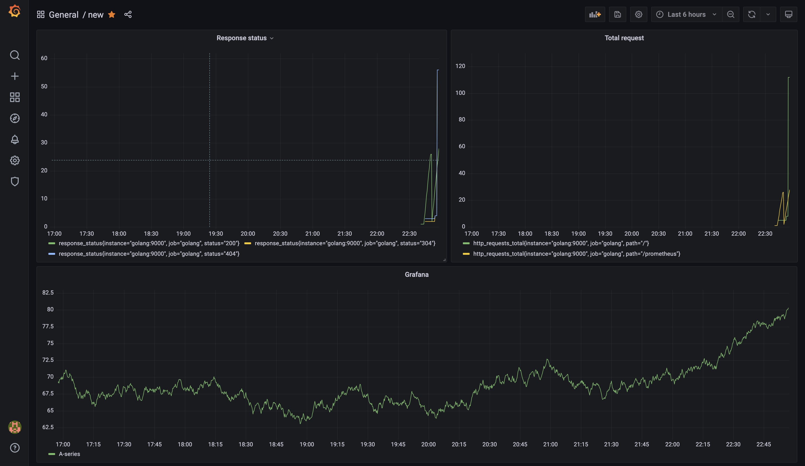

# 📈 Prometheus Monitoring

Example project to create monitoring application in **Golang** with **Prometheus** and **Grafana** for the visualization.
You don't need to install anything, expect [docker](https://docs.docker.com/engine/install/ubuntu/) and [docker-compose](https://docs.docker.com/compose/install/), for run the application.


# 🔋 How to run

You can easily run the app with [docker](https://docs.docker.com/engine/install/ubuntu/) and [docker-compose](https://docs.docker.com/compose/install/).

Start by checking if you have docker and docker-compose with the following commands

```
docker-compose --version
```

```
docker --version
```

Make sure the **Docker daemon** is running, if it's not, run the following command for **Linux** and start the application on **Mac**

```
sudo systemctl start docker
```

Once this is done you can start running the application with the following command:

```
docker-compose up -d
```

[Grafana link](http://localhost:3000/) | [Prometheus link](http://localhost:9090/) | [Application link](http://localhost:9000/)

# 🖥 How to setup Grafana

Normaly Grafana is already configured when you start the application. If you need a user and password when you first connect, you can find them below.

If **Grafana** is not configured when you run the application, just go to ```Configuration>Data Source```, click on ```Add data source```, select **Prometheus**.
Fill **URL** field with ```http://localhost:9090``` and set **Access** field on ```Browser```.

User:
```
admin
```
Password:
```
admin
```

# 📊 Visualization

